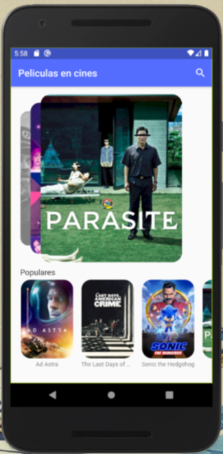

<!-- start project-info -->
<!--
project_title: peliculas_flutter
github_project: https://github.com/Radega1993/peliculas_flutter
license: MIT
icon: img/logo.svg
homepage: https://www.radega.com
license-badge: True
lastcommit-badge: True
codefactor-badge: True
--->

<!-- end project-info -->

<!-- start badges -->

<!-- end badges -->

<!-- start description -->
<h1 align="center">This is peliculas_flutter 👋</h1>

<h2>peliculas_flutter</h2>

peliculas_flutter is a mobile application to check films.
This is part from the flutter course made by Fernando Herrera

<!-- end description -->

<!-- start prerequisites -->
## Prerequisites

- mobile android/IOs

<!-- end prerequisites -->

<!-- start using -->
## Using peliculas_flutter

### Dev enviroment

Open with your text editor and run the app in a mobile emulator

<!-- end using -->

## App Views

### initial

### details

### Search

<!-- start contributing -->
## Contributing to peliculas_flutter

To contribute to **peliculas_flutter**, follow these steps:

1. Fork this repository.
2. Create a branch: `git checkout -b <branch_name>`.
3. Make your changes and commit them: `git commit -m '<commit_message>'`
4. Push to the original branch: `git push origin <branch_name>`
5. Create the pull request.

Alternatively see the GitHub documentation on [creating a pull request](https://help.github.com/en/github/collaborating-with-issues-and-pull-requests/creating-a-pull-request).

<!-- end contributing -->
